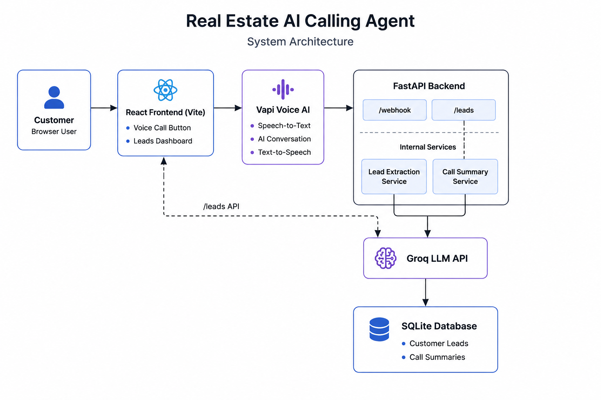
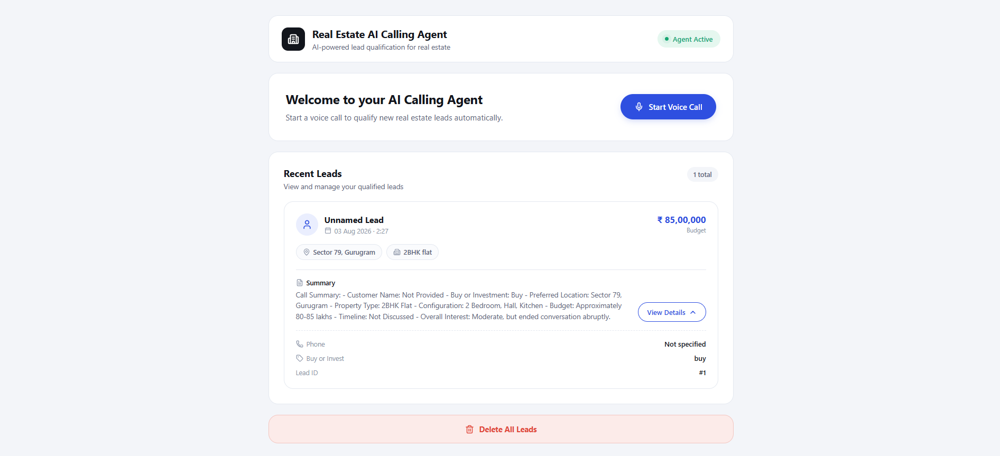

# 🏠 Real Estate AI Calling Agent

AI-powered Real Estate Voice Calling Agent that conducts natural conversations with prospective property buyers, qualifies leads, extracts customer requirements, and generates structured lead summaries.

---

## 🚀 Live Demo

**Frontend:** https://real-estate-ai-calling-agent-olive.vercel.app/

**Backend API:** https://real-estate-ai-calling-agent.onrender.com

---

## 🚀 Features

- 🎙️ AI Voice Calling using Vapi
- 🤖 AI Conversation powered by Groq LLM
- 🏡 Real Estate Sales Agent Persona
- 🌐 Supports Hindi, Hinglish, and English
- 📋 Automatic Lead Qualification
- 📝 AI-generated Call Summary
- 💾 Lead Storage using SQLite
- 📊 Modern React Dashboard
- 🔄 Live Lead Refresh
- 🗑️ Delete All Leads

---

## 🛠️ Tech Stack

### Frontend
- React
- Vite
- CSS
- Vapi Web SDK

### Backend
- FastAPI
- Python
- Groq API

### Database
- SQLite

### AI
- Groq LLM
- Custom Prompt Engineering

### Voice Platform
- Vapi AI

### Deployment
- Vercel (Frontend)
- Render (Backend)

---

## 📂 Project Structure

```text
real-estate-ai-calling-agent/

├── assets/
│   ├── Summary.png
│   ├── Voice call.png
│   └── dashboard.png
│
├── docs/
│   ├── architecture.png
│   
│
├── backend/
│   ├── app/
│   │   ├── data/
│   │   ├── database/
│   │   ├── prompts/
│   │   ├── services/
│   │   └── main.py
│   └── requirements.txt
│
├── frontend/
│   ├── public/
│   ├── src/
│   ├── package.json
│   └── vite.config.js
│
├── README.md
└── .gitignore
```

---

## 🎯 Conversation Flow

1. Greet Customer
2. Introduce as a Real Estate Representative
3. Ask whether the customer wants to Buy or Invest
4. Collect:
   - Preferred Location
   - Property Type
   - Configuration
   - Budget
   - Purpose
   - Purchase Timeline
5. Answer Customer Questions
6. Collect Customer Details
7. Generate AI-powered Call Summary
8. Save Lead Information
9. Display Lead in Dashboard

---

## 🏗️ System Architecture



---

## ⚙️ Installation

### Clone Repository

```bash
git clone <repository-url>
```

### Backend

```bash
cd backend

python -m venv venv

venv\Scripts\activate

pip install -r requirements.txt

uvicorn app.main:app --reload
```

### Frontend

```bash
cd frontend

npm install

npm run dev
```

---

## 🔑 Environment Variables

### Backend

```env
GROQ_API_KEY=your_groq_api_key
```

### Frontend

```env
VITE_VAPI_PUBLIC_KEY=your_public_key
VITE_VAPI_ASSISTANT_ID=your_assistant_id
```

> **Do not commit real API keys.**

---

## 📡 API Endpoints

| Method | Endpoint | Description |
|----------|----------|-------------|
| GET | / | Health Check |
| POST | /chat | Chat with AI |
| GET | /leads | Fetch Leads |
| DELETE | /leads | Delete All Leads |
| POST | /webhook | Receive Voice Call Transcript |

---

## 📸 Demo

### Homepage


---

### Voice Calling


---

### Lead Dashboard



---

## 📄 Documentation

Complete project documentation is available in:

**docs/Assignment_Documentation.pdf**

---

## 🚀 Future Improvements

- PostgreSQL Support
- Authentication
- CRM Integration
- Email Notifications
- Call Analytics
- Multiple Property Projects
- Call Recording Storage
- PSTN Phone Calling

---

## ⚠️ Known Limitations

- Uses a dummy real estate project for demonstration purposes.
- Browser-based voice calling only (no real PSTN phone integration).
- SQLite is used for demonstration and can be replaced with PostgreSQL for production deployments.
- Currently supports a single sample property project.

---

## 👨‍💻 Author

**Krishna**

B.Tech – Artificial Intelligence & Machine Learning

---

## 📄 License

This project was developed as part of an AI Internship technical assignment.
